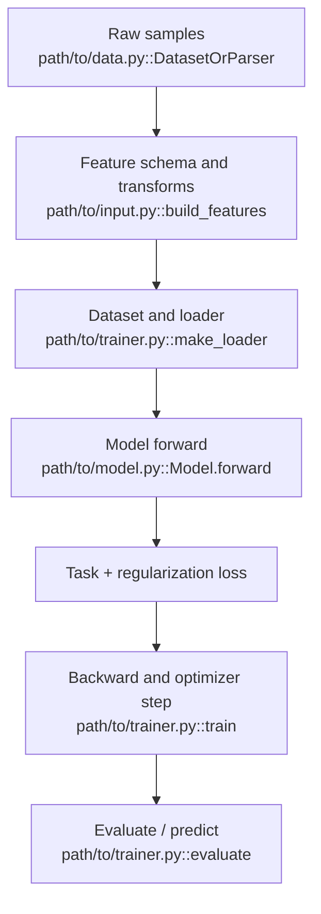
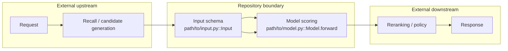

# Architecture Report Template

Use this template for repository-level architecture reports.

Build `algorithm-repo-analysis.json` first from measured repository statistics, the source-backed code index, targeted source reading, and Repomix status. Treat `assets/analysis-manifest.schema.json` as the contract. Markdown and HTML are two views of this manifest, not a serial conversion where HTML reads only Markdown.

Write for an engineer joining tomorrow. Organize details around questions and decisions, not the repository tree alone: what the system does, what it deliberately does not do, how data moves, which abstractions hold the design together, which representative models teach each family, and where a safe change begins.

## 1. 架构师定调与项目统计

- **一句话总结**：说明这是什么项目，解决什么行业痛点，适合工业链路哪一环。
- **技术栈盘点**：语言、核心框架、训练/评估依赖、数据处理依赖。
- **工程规模统计**：必须从当前源码或同一份新鲜 Repomix 快照统计主开发语言、语言分布、有效文件数、代码行数和角色代码规模，不得只复述 README。
- **算法资产统计**：按模型类型分类统计数量；必须附路径。
- **源码索引**：将 code index 写入共享 Manifest。至少记录 relative path、absolute path（如可得）、class/function、line number（如可得）、pipeline stage、model category。HTML 不得只渲染 Markdown。
- **Repomix 证据**：写明 reused/regenerated/fallback、`executionSource`、下载策略和失败原因。不要用含糊的“Repomix 不可用”替代可诊断信息。

Example categories:

- 召回模型：`path/to/model.py` / `ClassName`
- 粗排模型：`path/to/model.py` / `ClassName`
- 精排模型：`path/to/model.py` / `ClassName`
- 多任务/后链路模型：`path/to/model.py` / `ClassName`
- 通用 layers/operators：`path/to/layer.py` / `ClassName`

### Required Engineering-Scale Tables

Start with a compact summary:

| Metric | Value | Evidence/method |
|---|---:|---|
| Primary implementation language | Python/Java/C++/... | Core model/layer/trainer paths |
| Analyzed source files | ... | Fresh Repomix or local counter |
| Total code lines | ... | Tool and metric definition |
| Repository revision | ... | Git commit when available |

Add a **Language distribution** table:

| Language | Files | Code lines | Share | Main paths |
|---|---:|---:|---:|---|
| ... | ... | ... | ... | `...` |

Add a **Role-based source scale** table when roles exist:

| Role | Files | Code lines | Representative paths |
|---|---:|---:|---|
| Core models | ... | ... | `...` |
| Shared layers/operators | ... | ... | `...` |
| Data/input abstractions | ... | ... | `...` |
| Training/evaluation/inference | ... | ... | `...` |
| Examples | ... | ... | `...` |
| Tests | ... | ... | `...` |

Use the bundled `collect_repo_stats.py` non-empty physical-line result as the portable baseline. Fresh Repomix statistics or already-installed `cloc`, `scc`, or `tokei` may be secondary evidence. Never install a counter silently or mix incompatible metrics in one total. State method, revision, and material exclusions; use “not available” instead of invented precision.

## 2. 新人心智模型与核心抽象

Start with a compact mental model that explains the repository in 3-6 conceptual blocks. Then provide:

| Concept | Responsibility | Why it matters | Source anchors | Read before |
|---|---|---|---|---|
| ... | ... | ... | `path::Symbol` | ... |

Cover public entry points, feature/input schema, shared model base, shared layers/operators, training/evaluation loop, examples, and tests when present. Explicitly separate repository-owned functionality from upstream/downstream systems.

## 3. 工业级流水线拆解

Pick exactly one standard pipeline after domain identification.

### Recommendation/Ads

| Stage | Goal | Code paths/classes | Coverage | Implementation logic |
|---|---|---|---|---|
| Offline data & features | Build train/serving features | `...` | Full/Partial/Absent | ... |
| Match/Recall | Retrieve candidates | `...` | Full/Partial/Absent | ... |
| Pre-ranking | Cheap candidate scoring | `...` | Full/Partial/Absent | ... |
| Ranking | Rich model scoring | `...` | Full/Partial/Absent | ... |
| Reranking/business policy | Diversity, constraints, calibration | `...` | Full/Partial/Absent | ... |

### Search

| Stage | Goal | Code paths/classes | Coverage | Implementation logic |
|---|---|---|---|---|
| Offline docs & indexing | Parse docs, build index | `...` | Full/Partial/Absent | ... |
| Query analysis | Segment, rewrite, understand query | `...` | Full/Partial/Absent | ... |
| Recall | Retrieve candidates | `...` | Full/Partial/Absent | ... |
| Pre-ranking | Cheap scoring/filtering | `...` | Full/Partial/Absent | ... |
| Ranking | Relevance/rank model | `...` | Full/Partial/Absent | ... |
| Reranking | Diversify, dedupe, policy | `...` | Full/Partial/Absent | ... |

### Generic ML/NLP/CV

| Stage | Goal | Code paths/classes | Coverage | Implementation logic |
|---|---|---|---|---|
| Data input & preprocessing | Dataset, transforms, loaders | `...` | Full/Partial/Absent | ... |
| Core model/network | Architecture and layers | `...` | Full/Partial/Absent | ... |
| Training/evaluation/inference | Loops, metrics, exports | `...` | Full/Partial/Absent | ... |

## 4. 核心数据流转链路

For Markdown, use validated Mermaid as the primary representation. Plain text-arrow diagrams are only an explicit compatibility fallback.

Use `flowchart TD` for deep offline training/control flow:

Use `flowchart LR` for online boundaries:

For representative model internals, show branches, merges, sequence processing, experts/gates/towers, and useful tensor shapes rather than flattening the topology. Use quoted node labels for paths, Symbols, punctuation, tensor shapes, and non-ASCII text. Distinguish repository-owned and external/uncovered nodes without relying only on color.

Every important node must carry a concise operation and `path::Symbol`, either in the node or in a source-anchor list immediately below the diagram. Do not rely on Mermaid `click` directives because renderer security policies differ. Split oversized graphs. Markdown and HTML must preserve the same node order, ownership boundaries, and conclusions.

For HTML, convert these flows into visual reading components instead of plain terminal text:

- Use native HTML/CSS only unless the user permits external libraries.
- Prefer numbered step cards, arrows, swimlanes, stage timelines, or clickable flow panels.
- Each node must contain: stage title, one-sentence logic, and precise path/class anchors such as `path/to/model.py::Model.forward`.
- Use code blocks only for actual code snippets, tensor traces, or optional raw details. The main online/offline data flow must be visual.
- If the flow is long, split it into multiple visual sections: offline training flow, online request scoring flow, and representative model forward flow.

## HTML Report Quality Bar

When generating an HTML version of the report:

- Read and apply `references/html-experience-design.md`; it is the complete frontend contract for HTML reports.
- Include a table of contents with smooth scrolling.
- Render industrial pipeline mapping as an interactive dashboard or flow navigation.
- Render core data-flow links as readable diagrams, not raw `.txt` blocks.
- Translate Markdown Mermaid semantics into native HTML/CSS diagrams; do not add a Mermaid runtime or CDN dependency by default.
- Preserve every important file path/class name inside visual nodes.
- Generate a visible “Code Map” or clickable path chips for models, layers, examples, trainers, and tests.
- Provide search/filter controls for model names, symbols, paths, pipeline stages, and categories when the code index is non-trivial.
- Keep persistent navigation available across normal desktop widths.
- Make pipeline nodes, tabs, drawers, search, theme controls, and source actions keyboard-operable with visible focus and meaningful ARIA state.
- Use restrained motion and clear feedback for selection, copy, filtering, expansion, and navigation. Respect `prefers-reduced-motion`.
- Keep wide tables and flows readable at the required desktop widths; use deliberate internal scrolling when a topology cannot fit without shrinking labels.
- If source navigation is requested, follow `references/html-code-navigation.md`.
- Use a polished algorithm-engineering cockpit visual language; no external CDN dependency by default.
- Complete the strongest QA level available. With browser automation, perform the desktop checks in `references/html-experience-design.md`; in CLI-only environments, run the bundled static validator and explicitly disclose that visual browser QA was not executed. Add tablet/mobile work only when explicitly requested.

## 5. 核心模型与模型家族

Do not present a flat model-name catalog. Group by architectural family and choose representative models. Every core model row must answer:

| Model | Problem solved | Architectural idea | Shared layers | Example | Test | Why learn it | Source |
|---|---|---|---|---|---|---|---|
| ... | ... | ... | `...` | `...` | `...` | ... | `path::Class` |

Explain family evolution and trade-offs: what becomes more expressive, more expensive, sequence-aware, multi-task, or easier to deploy. Mark models as `core`, `important`, `supporting`, or `reference`; “core” means architecture-representative, not merely exported.

## 6. 新人阅读路线

Provide at least two goal-oriented tracks when the repository supports them:

- **快速理解主链路**：5-8 ordered stops from an executable example through shared abstractions to one representative model and its test.
- **深入模型设计**：ordered model families and prerequisites.
- **准备修改/扩展**：entry point, extension boundary, regression test, and likely side effects.

Each stop must state what question it answers, expected reading depth, and `path::Symbol`. A bare path list is insufficient.

## 7. 修改入口

Map common newcomer intents to the smallest safe change surface:

| Intent | Start here | Related code | Validation | Risk/contract |
|---|---|---|---|---|
| Add a model / feature / loss / dataset / metric | `path::Symbol` | ... | `test path` | ... |

Only include intents supported by repository evidence. Name hidden contracts such as tensor shape, Feature Column ordering, shared Embedding ownership, task count, loss output, serialization, or serving format.

## 8. 架构评估与局限性分析

Cover:

- Modularity and boundaries.
- Feature abstraction and embedding design.
- Training/evaluation completeness.
- Serving/export/production gaps.
- Scalability risks for large datasets, long sequences, huge vocabularies, or distributed training.
- What a production team would need to add.
